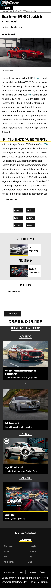

# Procesverslag
**Auteur:** -Dirk Groot-

Markdown cheat cheet: [Hulp bij het schrijven van Markdown](https://github.com/adam-p/markdown-here/wiki/Markdown-Cheatsheet). Nb. de standaardstructuur en de spartaanse opmaak zijn helemaal prima. Het gaat om de inhoud van je procesverslag. Besteedt de tijd voor pracht en praal aan je website.

## Bronnenlijst
1. -https://www.w3schools.com/howto/howto_css_image_center.asp-
2. -Robert feedback op voortgang en laad meer knop code (docent) -
3. -Victor feedback op voortgang(student assistent)-
4. -Rowin hulp met flexbox voor small article-
5. -https://stackoverflow.com/questions/8572952/border-length-smaller-than-div-width-
6. -https://stackoverflow.com/questions/25446806/centered-responsive-text-
7. -https://www.w3schools.com/howto/howto_css_contact_form.asp-

## Eindgesprek (week 7/8)

-dit ging goed & dit was lastig-

**Screenshot(s):**

-  -
-  -

## Voortgang 3 (week 6)

-Eigenlijk weinig progressie gemaakt sinds het laatste voortgangs gesprek.-

## Voortgang 2 (week 5)

-Pagina die ik heb opgebouwd (pagina1) ziet er goed uit. Loop dus een beetje achter want moest al n deel van pagina 2 hebben.
 Heb nuttige vragen gesteld die hebben geholpen nu kan ik weer verder bouwen.-

## Voortgang 1 (week 3)

### Stand van zaken

-Ik vind het nog lastig om ervoor te zorgen dat de dingen in de goede volgorde komen te staan door middel van bijvoorbeeld flexbox. Ook wilde ik graag al een uitklapbare zoekbalk maken maar dat is mij nog niet gelukt. Als dingen mij niet lukte ging ik verder met wat anders zodat ik toch nog kon doorwerken.-

**Screenshot(s):**

Ik weet dat dit beter kan want dit is erg omslachtig alleen ik kon zo niet 123 bedenken hoe ik dat dan zou moeten aanpakken.
 
 Dit deel wilde ik namaken maar vond ik erg lastig is dus ook niet echt gelukt

### Agenda voor meeting

-samen met je groepje opstellen-

| student 1      | student 2          | student 3    | student 4        |
| ---            | ---                | ---          | ---              |
| dit bespreken  | en dit             | en ik dit    | en dan ik dat    |
| an dat ook nog | dit als er tijd is | nog een punt | dit wil ik zeker |
| ...            | ...                | ...          | ...              |

### Verslag van meeting

-Ik moet mijn hele html verwijderen. Ik denk zelf ook dat dat beter is. -

## Breakdownschets (week 1)

## Intake (week 1)
-uitwerken voor de kick-off werkgroep - begin van de eerste week-

**Je startniveau:** -Blauw-

**Je focus:** -surface plane-

**Je opdracht:** -https://topgear.nl-

**Screenshot(s) van de eerste pagina (small screen):**

**Screenshot(s) van de tweede pagina (small screen):**

